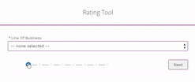

# Progress Bar Embedded In Flow Footer

A flow footer that displays a progress bar(more like progress steps). It uses current flow stages and active flow stages to create the progress steps.

## Instructions
1. Download the src folder and rename it to `progressBar` or any naming convention. Just make sure that the naming is consistent with the file names and within the code.
2. Go onto flow (In lightning experience: setup > process automation > flows). You should see the component as a custom component when using a screen component. Drag it onto the screen.
3. Fill in the fields. 
    - For `showNext` or `showPrevious`, use `{!$GlobalConstant.True}` for true and `{!$GlobalConstant.False}` for false assignment. If the screen is the last screen, you might want to change the label to `Finish` instead of `Next`.
    - Set your stages in your resources and assign your current stage accordingly before each screen. In the fields, use `$Flow.ActiveStages` for your `stages` field and `$Flow.CurrentStage` for your current stage field.
4. If you want to use this in Partner Community and override the css using selectors. Refer to `progressBar.css` under `/**Override for typical behavior**/` and just copy and paste the css. You might need to tweak the selectors depending on your Partner Community.
5. Enjoy! Give this repo a star if you have benefitted from it.

**IMPORTANT NOTE:** If you want to access the previous screen without errors, ensure that in the component go to Advanced > click on Manually assign variables and leave all the fields blank.

## Demo
